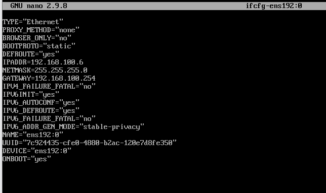

***CPE Lyon - 3ICS - Année 2021/22***
***Administration des systèmes Linux***
# TD1 – Service Web
***Emile Metral***
***Version adaptée pour un travail sur le Cluster ESXi***


L’objectif de ce TD est : <br>
- de découvrir une nouvelle distribution Linux et ses spécificités (sécurité, gestion des packages...)
- de découvrir la notion d’adresse IP virtuel
- d’installer et configurer un service web (Apache)

***Vous devrez répondre a toutes les questions et rendre un document numérique avec vos réponses. Les modalités de rendu vous seront communiquées par l’enseignant qui vous encadre.***

1- Les VM Centos 8 sont déployées dans la ferme. Vous trouverez un fichier vous donnant les VM ainsi que les plages d’IP qui vous sont attribuées.
- La VM est une CentOS MINIMAL ( SANS Interface Graphique ) avec :
  -  Une seule carte réseau.
  -  2 GO de RAM
  -  CPU avec 2 cores.

2-Désactivation de SELinux
- [2A] A quoi sert ce composant ?
```
SELinux est une architecture de sécurité qui permet de gérer les accès pour les applications, processus et fichiers système. 
```

- [2B] Comment peut on le désactiver momentanément (Il existe au moins 2 moyens)
```
Moyen 1 : 
Pour désactiver SELinux temporairement, dans le cadre d'un test par exemple :
setenforce 0

Moyen 2:
echo 0 > /sys/fs/selinux/enforce

```
- [2C] Comment peut-on le désactiver de façon permanente ?
```
Pour que ce changement soit permanentent il faut aller modifier le champ suivant dans le fichier « /etc/selinux/config » :

SELINUX=enforcing

Le « enforcing » signifie que la politique de sécurité SELinux est  appliquer, pour ne plus l’appliqué il faut remplacer « enforcing » par « permissive »:

SELINUX=permissive
```
- Désactivez SELinux.


3-Désactivation momentané du pare-feu.
- [3A] Quelle commande vous permet de désactiver temporairement le firewall, le temps de procéder a la configuration de la machine ?
```
On le stoppe : systemctl stop firewalld
Puis on le désactive : systemctl disable firewalld
```
- [3B] Quelle commande vous permet d’avoir la certitude que le firewall est bien inactif ?
```
systemctl status firewalld

Resutalts :
● firewalld.service - firewalld - dynamic firewall daemon
   Loaded: loaded (/usr/lib/systemd/system/firewalld.service; disabled; vendor preset: enabled)
   Active: inactive (dead)
     Docs: man:firewalld(1)

Nov 15 08:53:48 localhost.localdomain systemd[1]: Starting firewalld - dynamic firewall daemon...
Nov 15 08:53:49 localhost.localdomain systemd[1]: Started firewalld - dynamic firewall daemon.
Nov 15 08:59:23 localhost.localdomain systemd[1]: Stopping firewalld - dynamic firewall daemon...
Nov 15 08:59:24 localhost.localdomain systemd[1]: Stopped firewalld - dynamic firewall daemon.
```

4-Installation du service Apache (La configuration réseau avancé viendra par la suite)
-   [4A] Quels sont les trois principaux serveurs WEB disponible sous Linux
```
Les trois principaux serveurs WEB sont : 
-   Apache 
-   Nginx
-   OpenResty
```
-   [4B] La commande dnf (ou anciennement yum) permet d’installer les packages.
    -   Quelle commande permet de retrouver le nom du package contenant le serveur Apache ? `dnf search apache`

    - Quelle commande permet d’installer le serveur Apache ?  `sudo yum install httpd`
-   [4C] Démarrage du service Apache
		-Quelle commande permet de démarrer le service Apache ? `sudo service httpd start`
-   [4D] Quelle commande vous permet d’avoir la certitude que le service Apache est fonctionnel ? `sudo service httpd status`
-   [4E] Quelles informations essentielles vous sont fournies par cette commande ?`Cette commande nous permet de savoir si le service est actif et si il est activé entre autres.`
  

5-Configuration du service Apache
-   [5A] Ou se trouvent les fichiers de configuration de Apache ? `/etc/httpd/`
-   [5B] Quelle est la structure de ce répertoire ? 
```
httpd/
|----- conf/ les fichiers de configurations principaux d'Apaches 
|----- conf.d/ Les fichiers secondaires de configuration
|----- conf.modules.d Dossier contenant les fichiers de configurations des extensions
|----- modules Dossier où se trouve les modules
A créér : 
|------ sites-available : stocke les configurations de tout nos sites
|------ sites-enabled : stocke les configurations des sites actifs
```
-   [5C] Ou se trouve le fichier de configuration principal ? `/etc/httpd/conf/httpd.conf`
-   [5D] Que contient (du point de vue logique) le répertoire conf.d `Les fichiers secondaires de configuration`
-   [5E] Que contient le répertoire conf.modules.d `Les fichiers de configurations des extensions`
-   [5F] Qu’est-ce qu’un module ? `Un module est utilisé pour ajouter de nouvelles fonctionalités à Apache.`
-   [5G] Ou sont-ils stockés ? `/etc/httpd/modules`
-   [5H] Ou sont stockés les log de Apache ?`/var/log/httpd/`

6-Exploration de la configuration de base (fichier httpd.conf)
-   [6A] Qu’est ce que le ‘DOCUMENT ROOT’ ? `Répertoire où le serveur va chercher les documents à servir aux requêtes`
-   [6B] Sur quel répertoire pointe-t-il ? `/var/www/html`
-   [6C] A quoi sert la directive ‘Listen’ `À définir un port et/ou une adresse sur laquelle écouter les requêtes.`
-   [6D] A quoi  sert la déclaration <Directory > `Définir des règles d'accès sur un répertoire ici de base il refuse tous les accès tant qu'on a pas déclarer explicitement le contraire.`
-   [6E] A quoi servent les directives ‘AllowOverride’ et ‘Require’ ? 
```
AllowOverride : Définit la classe de directives autorisé pour le repéretoire.

Require : Définit un contrôle d'accès à un répertoire définit. 
```
-   [6F] A quoi sert le fichier welcome.conf ? `Sert à définir un page d'acceuil si il n'y a pas d'index dans le le répertoire root par défaut`
-   [6G] A quoi sert la commande apachectl ? `Permet de controler les fonctionnalité du service Apache httpd`


7-Tests et Installations complémentaires
	Un serveur Apache reste basiquement un serveur de fichiers utilisant le protocole HTTP. Il lui manque fondamentalement un certain nombre de composants permettant d’avoir le comportement d’un serveur WEB avec des pages dynamiques. Vous allez installer le moteur d’exécution PHP (php engine) permettant au serveur web d’exécuter du code php présent dans les pages web.
-   [7A] Exécutez la commande yum install php -y , Quels packages sont installés ? `Les packages de php 7.2 et ses modules common, cli, et fpm sont installés`
-   [7B] Le service Apache utilise désormais systématiquement  le package ‘php-fpm’ contenant les éléments nécessaires pour l’exécution de pages web dynamiques. Que contient ce package ? `Ce package contient la gestion avancée des processus, la journalisation, le rédémarrage d'urgence en cas de destruction accidentelle du cache opcode, le support de l'upload accéléré, la journalisation des scripts qui s'executent lentement, la naissance de processus fils, les informations sur la SAPI et les chiers de configuration basé sur php.ini.`
-   [7C] Comment prouver que le serveur Web est désormais capable d’exécuter du PHP ?
```
On créé une page avec du php dedans : 
nano /var/www/html/index.php
avec dedans :

<?php phpinfo(); ?>

```
-   [7D] Quelle version de php est installée ? `PHP Version 7.2.24`
-   [7E] Comment connaître la configuration compléte du serveur web (librairies installées, avec leurs versions et configurations?)
-   [7F] Installez les packages et donnez le rôle des packages suivants :
		- php-gd : Manipulation d'images
		- php-mysqlnd : Manipulation des données mysql 
		- php-pdo : Interaction avec une base de données
		- php-mbstring : Manipulation des chaine de caractère
```
yum -y install php-mysqlnd php-pdo php-gd php-mbstring
```

8- Configuration avancée <br>
Vous allez procéder à une configuration avancée (mais pas forcément conventionnelle) vous permettant de toucher du doigt les principaux points clefs d’une configuration : problèmes de permissions et d’accès, configuration de serveurs virtuels par IP, configuration de serveurs virtuels par nom.  
	● [8A] Installez le service vsftp, et bien sûr, vérifiez qu’il est opérationnel. Qu’avez vous fait comme commande ? `yum -y install vsftpd.x86_64 && service vsftpd status`
	● [8B] Créez un compte utilisateur nommé ‘web’.	Le répertoire de travail de l’utilisateur ‘web’ contiendra les dossiers hébergeant les différents sites web gérés par l’utilisateur ‘web’ :
		-un dossier www.campagne.sys pour  l’instance httpd virtuel qui répondra aux requêtes sur une IP (serveur virtuel par IP, cf virtualhost)
		-un dossier www.montagne.sys et www.glacier.sys pour l’instance httpd virtuel qui répondra aux requêtes les deux domaines (Hébergement mutualisé, cf web multi-homing )
		-un dossier www.sommet.sys pour tester la mise en place d’un serveur répondant aux requêtes https.
Donnez la liste des commandes utilisées.
```bash
sudo useradd web --create-home --shel /bin/bash; 
mkdir -p /home/web/www.campagne.sys /home/web/www.glacier.sys /home/web/www.montagne.sys /home/web/www.sommet.sys
chown web:web -R /home/web/
```
	● [8C] Vérifiez que vous pouvez accéder en lecture/écriture a tous les répertoires présents dans le répertoire /home/web en utilisant un client ftp comme FileZilla. Donnez les permissions de /home/web ainsi que celles des dossiers précédemment créés
```
Vérification des droits : 
stat -c "User:%U Rights:%A Directory:%N" /home/web/
Résultat : 
User:web Rights:drwx------ Directory:'/home/web/'

stat -c "User:%U Rights:%A Directory:%N" /home/web/*
Résultats :
User:web Rights:drwxr-xr-x Directory:'/home/web/www.campagne.sys'
User:web Rights:drwxr-xr-x Directory:'/home/web/www.glacier.sys'
User:web Rights:drwxr-xr-x Directory:'/home/web/www.montagne.sys'
User:web Rights:drwxr-xr-x Directory:'/home/web/www.sommet.sys'
```

9-Configuration réseau : <br>
***Votre VM est connectée sur un réseau en 172.16.0.0/16***<br>
***Pour les configurations réseau, les Linux de la famille RedHat/CentOS utilisent des fichiers de configurations situés dans /etc/sysconfig/network-scripts.***<br>
***Classiquement, les fichiers portent le nom ‘ifcfg-nom_carte_reseau’. La commande ip addr permet de voir les différents périphériques réseaux reconnus par le système au démarrage et de récupérer leurs noms.***<br>
Voici un fichier de configuration minimal permettant de configurer une carte réseau nommée ‘enp1s0’ avec une IPV4 statique. Vous devez l’adapter a votre configuration :
```
TYPE="Ethernet"
BOOTPROTO="static"
DEFROUTE="yes"
NAME="enp1s0"
DEVICE="enp1s0"
ONBOOT="yes"
IPADDR=192.168.0.5
NETMASK=255.255.255.0
GATEWAY=’gateway declaré pour le vmnet8’
```
-   [9A] Configurer votre carte réseau avec l’IP fixe 172.16.xxx.5/24 et donnez le contenu du fichier.
```

```
-   [9B] A quoi sert la commande nmcli  `Elle permet de controller le service network manager`
-   [9C] A quoi sert le service NetworkManager `Le service NetworkManager permet de gérer plus facilement les connections réseaux` 
-   [9D] A quoi sert le fichier /etc/resolv.conf ? `le fichier de configuration de la bibliothèque resolver permettant de déterminer, entre autre, quel serveur DNS utiliser pour résoudre un nom de domaine.`
-   [9E] Que devez-vous faire comme tests pour vérifier la connectivité de votre VM ? `ping 1.1.1.1`
-   [9F] Votre machine peut-elle joindre www.free.fr ? Quelle commande avez vous utilisez pour le vérifier ? `ping free.fr et elle le peut`
-   [9G] Votre VM peut-elle être jointe par l’un de vos collègues ? Si non, pourquoi ? Quels tests avez vous effectués ?  `Oui elle peut être jointe. ping 192.168.100.6  fonctionne . `

10-IP Virtuelles <br>
***Vous allez rajouter 3 IP virtuelles a votre VM.***
***Classiquement, pour rajouter une IP virtuelle, il faut créer un fichier de configuration par IP virtuelle,  dont le nom est de la forme, par exemple, ifcfg-ens33:0 pour la première IP virtuelle portée par la carte réseau ens33  ou ifcfg-ens33:1 pour la seconde IP virtuelle portée par la même carte réseau ens33, et ainsi de suite.***
Voici un exemple de configuration pour une IP virtuelle :  (/etc/sysconfig/network-scripts/ifcfg-ens33:0)
```
TYPE="Ethernet"
BOOTPROTO="static"
DEFROUTE="yes"
NAME="ens33:0"
DEVICE="ens33:0"
ONBOOT="yes"
IPADDR=192.168.80.6
NETMASK=255.255.255.0
```
- [10A] Ajouter trois adresses IP virtuelles :
  -   172.16.xxx.6/16  permettant de contacter le site web www.campagne.sys

    -   172.16.xxx.10/16  permettant de joindre www.montagne.sys et www.glacier.sys
  
    -   172.16.xxx.15/16 permettant de joindre www.sommet.sys

	Donnez le contenu des 3 fichiers de configuration.	
- [10B] Comment prouver que votre configuration est fonctionnelle ?

11- Configuration du premier serveur virtuel : serveur virtuel par IP
	Ce premier serveur virtuel par IP nous permettra de joindre le site web hébergé a l’URL http://172.16.xxx.6.
	Vous êtes invité a lire la page https://httpd.apache.org/docs/2.4/fr/vhosts/examples.html
-   [11A] Créez le premier serveur web virtuel. La racine (DocumentRoot) de ce serveur web sera bien sûr le répertoire www.campagne.sys. Donnez le nom et le contenu du fichier de configuration.
```
<VirtualHost 192.168.100.6:80>
  ServerName www.campagne.sys
  ServerAlias campagne.sys
  DocumentRoot /home/web/www.campagne.sys/
  ErrorLog /var/www.campagne.sys/logs/error.log
  CustomLog /var/www/www.campagne.sys/logs/access.log combined
</VirtualHost>
```
-   [11B] Prouvez que votre serveur virtuel est a l’écoute et joignable depuis une machine présente sur le réseau vmnet8. Quelle est votre démarche ?
-   [11C] Testez votre configuration en utilisant votre navigateur (depuis votre Windows ou depuis une autre VM). Pouvez-vous prouver que c’est bien le serveur virtuel que vous venez de configurer qui a répondu ? Comment ?
-   [11D] Votre serveur vous a retourné un message « access denied » ? C’est probablement normal, pourtant vous avez prouvé qu’il était a l’écoute :
		-A quoi sert la directive « Allow » dans le fichier de configuration.
		-Quelles sont les permissions sur le répertoire /home/web et /home/web/www.campagne.sys ?
		-Proposez une solution « propre » pour résoudre le problème.
-   [11E] Déployez l’application web phpsysinfo (http://phpsysinfo.github.io/phpsysinfo/)  dans le répertoire www.campagne.sys et fournissez une copie d’écran de la page d’accueil de cette application.
-   [11E] Testez l’URL http://172.16.xxx.5 Avez vous obtenu une réponse ? Si Oui pourquoi ?

12- Serveur virtuel par nom
Les pages https://httpd.apache.org/docs/2.4/fr/vhosts/examples.html et https://httpd.apache.org/docs/2.4/fr/vhosts/name-based.html contiennent les informations nécessaires a la configuration des serveurs virtuels par nom.
	● [12A] Créer les deux serveurs webs virtuels répondant pour le domaine www.montagne.sys et www.glacier.sys sur l’IP 172.16.xxx.10 et donnez le contenu du/des fichier·s de configuration.
	● [12B] Avez vous vu la note concernant la configuration des DNS ? Donnez-en un résumé
	● [12C] Mettez en place une solution permettant de garantir que le serveur virtuel hébergeant www.montagne.sys est bien le bon a répondre et procédez aux tests. Justifiez votre démarche.
	● [12D] Testez l’URL http://172.16.xxx.5 . Quel serveur virtuel a répondu ? Est-ce le comportement attendu ? Justifiez votre réponse.  
	● [12E] Avez vous vu la note intitulée « Le serveur principal disparaît » ? Quelle information essentiel contient-elle ?

13-Serveur virtuel, HTTPS et SSL
	Vous avez remarqué que les serveurs virtuels ne répondent pas sur le port 443. Vous allez mettre en place un serveur web avec chiffrement fort SSL/TLS.
	La page https://httpd.apache.org/docs/2.4/fr/ssl/ssl_howto.html devrait vous aider.
	● [13A] Avez vous vérifié que le module nécessaire a l’utilisation du HTTPS était installé et chargé ? Quel est le nom du module ? qu’avez vous fait pour vérifier qu’il était chargé en mémoire par Apache ?
	● [13B] La commande « openssl req -x509 -nodes -newkey rsa:1024 -keyout serveur.cle -out certificat.pem » permet de générer les fichiers nécessaires pour l’utilisation de l’https.
		-A quoi sert l’option « -x509 »
		-A quoi sert le paramètre « rsa:1024 » de l’option « -newkey » ? Ce paramétre est-il pertinent a l’heure actuelle ?
		-Quels sont les fichiers générés ? Que contiennent-ils ?
	● [13C] Mettez en place le serveur virtuel www.sommet.sys Il devra répondre sur les ports 80 et 443, et donnez le contenu du fichier de configuration.
	● [13D] Quel message avez-vous obtenu lors de vos tests avec votre navigateur ? Pourquoi avez vous obtenu ce message ?
	● [13E] Connaissez vous le site Let’s Encrypt (https://letsencrypt.org/fr/). Quel est son rôle ? Comment peut-il vous aidez pour le problème précédent ?

14-Restriction de l’accès utilisateur
	Dans certains cas, il sera nécessaire de restreindre les accès a certains répertoires, ou alors d’autoriser des opérations particulières comme la réécriture d’URL (souvent nécessaire pour l’utilisation d’un framework PHP)
	Le fragment de configuration suivant permet de restreindre l’accès au répertoire « demo » :
<Directory demo >
	AuthName "You need an account !"
	Require valid-user
	… autres parametres...
</Directory>

	● [14A] Quels sont les modes d’authentification possibles?
	● [14B] Qu’est ce qu’un fournisseur d’accès dans ce contexte?
	● [14C] Pour le site www.campagne.sys, créer un répertoire « secure » et vérifier que vous pouvez bien accéder au contenu de ce répertoire. Quels tests avez-vous effectués ?
	● [14D] Changer la configuration de ce serveur virtuel pour restreindre l’accès au répertoire « secure ». Vous utiliserez une authentification « basic » avec un « provider file». Donnez le contenu du fichier de configuration.
	● [14E] Créez un utilisateur « Apache » avec les identifiants « leon/123+aze » et vérifiez qu’il a bien accès au répertoire « secure » . La commande htpasswd vous sera nécessaire. Quels tests avez-vous effectués ? Quelles commandes avez-vous utilisées ?
	● [14F] Quelle démarche vous a permis de vérifier que le compte « leon » avec le mot de passe « 123+aze » a bien accès au répertoire « secure » ?
	
15-Fichier .htaccess 
	Ce fichier permet de redéfinir certains paramètres de configuration du serveur ou certains accès a des répertoires sans avoir toucher les fichiers de configuration du serveur Apache, donc sans avoir a être « root ». La seule contrainte est que le fichier de configuration  (du serveur virtuel) autorise une modification de ces paramètres (directive AllowOverride) pour le répertoire ou l’arborescence contenant le fichier .htaccess
	● [15A] Qu’est ce qu’une réécriture d’URL ? Quel module est nécessaire pour faire une réécriture d’URL ?
	● [15B] Qu’est ce qu’un Framework ?
	● [15C] A quoi sert la directive AllowOverride ?
	● [15D] Quels sont les 6 paramètres pris en compte par la directive AllowOverride ?
	● [15E] Lequel des paramètres permet d’autoriser l’usage d’une réécriture d’URL a partir d’un fichier .htaccess ?
	● [15F] Créez un répertoire « private » avec un fichier .htaccess. Donnez le contenu du fichier .htaccess
	● [15G] Dans le fichier .htaccess précédent, mettez en place les directives nécessaires pour autoriser uniquement l’utilisateur « Apache gaston/123+aze » a accéder au répertoire. Quelle est votre démarche ? Quelles commandes avez vous utilisées ?

16-Personnalisation de pages d'erreurs
	Il est extrêmement désagréable et peu rassurant pour un utilisateur de rencontrer une erreur d’exécution  (Erreur PDO, erreur 404, erreur 500 …)
	Sur un serveur de production il est préférable de mettre en place une gestion des erreurs, qui affichera un message personnalisé.
	● [16A] Utilisez la directive « ErrorDocument » pour afficher une jolie page d’erreur 404. Cette URL devrait vous inspirer : https://www.leptidigital.fr/webmarketing/pages-erreur-404-8896/ . Quels fichiers avez-vous modifiés ? Donnez les modifications.


17-Pour allez plus loin
	Vous êtes invité à explorer la mise en place de système d’équilibrage de charge basé sur HAProxy ou  LVM/KeepAlived
	La notion d’IP virtuelle vous permet d’entrevoir la notion de HA en utilisant HAProxy ou KeepAlived
	Les serveurs Web sont souvent couplés avec :
		-memcached
		-REDIS
		-MongoDB
		-MySQL
Il serait bénéfique d’avoir des connaissances de base sur ces technologies.
