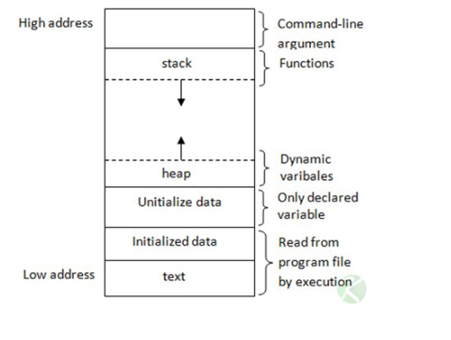

***CPE Lyon - 3ICS - Année 2021/22***

**Administration des systèmes Linux**

# TD4 – Programmation C Système / Les processus

Ce cours et TD porte sur l’utilisation des appels système des systèmes de la famille Unix : 
Linux, MacOS X, AIX,  LynxOS, BeOS, QNX, OpenBSD, FreeBSD,NetBSD.
Le rôle d’un système est de :
-   Gérer le matériel :
    - Masquer le matériel en permettant aux programmes d’interagir avec le matériel à 
travers des pilotes; 
    -   Gérer le processeur : c'est-à-dire gérer l'allocation du processeur entre les différentes
applications grâce à un algorithme d'ordonnancement. 
    - Gérer la mémoire : c'est-à-dire gérer l'espace mémoire alloué à chaque application 
et, le cas échéant, à chaque usager. En cas d'insuffisance de mémoire physique (RAM), le système d'exploitation peut créer une zone mémoire sur le disque dur, appelée mémoire virtuelle.
    - Gérer les entrées/sorties : c'est-à-dire gérer l'accès des programmes aux ressources 
matérielles par l'intermédiaire des pilotes.
    - Gérer l'exécution des applications : c'est-à-dire s'assurer de la bonne exécution des applications en leur affectant les ressources nécessaires à leur bon fonctionnement, mais aussi permettre de tuer une application ne répondant plus correctement, par exemple.
    - Gérer les fichiers : c'est-à-dire gérer la lecture et l'écriture dans le système de fichiers et les droits d'accès aux fichiers par les utilisateurs et les applications. 
-   Fournir une interface pour les programmes (un ensemble d’appels système) 
-   Fournir une interface bas niveau pour l’utilisateur (un ensemble de commande shell)
L’objectif de ce TD est :
    -   de découvrir le principe des programmes et processus.

Vous devrez répondre a toutes les questions et rendre un document numérique avec vos 
réponses.

## 1- Quelques définitions
### 1. Parallélisme et pseudo-parallélisme

La base des ordinateurs modernes, c'est le parallélisme. Il est désormais inconcevable qu'un 
ordinateur ne puisse exécuter plusieurs programmes en même temps.

Du point de vue matériel, le processeur passe d'un processus à un autre en quelques millisecondes, ce qui va donner à l'utilisateur une impression de simultanéité. C'est le pseudo-
parallélisme, à différencier avec le véritable parallélisme des systèmes multiprocesseurs.

Les processus sont la base du pseudo-parallélisme.
2. Programmes et processus

Il est très important de différencier la notion de programme et la notion de processus.

La définition exacte d'un processus, c'est programme en cours d'exécution auquel est associé
un environnement processeur et un environnement mémoire. En effet, au cours de son exécution, 
les instructions d'un programme modifient les valeurs des registres (le compteur ordinal, le registre d'état...) ainsi que le contenu de la pile.

Un programme, c'est une suite d'instructions (notion statique), tandis qu'un processus, c'est 
l'image du contenu des registres et de la mémoire centrale (notion dynamique).

### 3. Espace d’adressage des processus
Chaque processus possède un espace d'adressage, c'est-à-dire un ensemble d'adresses 
mémoires dans lesquelles il peut lire et écrire.
Cet espace est divisé en trois grandes parties :
- le segment de texte (le code du programme) ;
- le segment de données (les variables) ;
- la pile.

Voici une schématisation d'un espace d'adressage :


### 4. Virtualisation de la mémoire   

Les adresses de mémoire manipulées par le code utilisateur ne correspondent pas forcément à des adresses physiques: la même adresse mémoire dans deux processus peut correspondre à deux locations physiques distinctes, et une adresse peut même ne pas correspondre à de la mémoire du tout, mais être simulée par des données stockées sur disque. La mémoire est donc virtualisée, le système présentant à l’utilisateur une abstraction qui ressemble à de la mémoire physique, mais peut être implémentée de diverses manières.

### 5 Ordonnancement des processus 

Un système d'exploitation est préemptif lorsqu'il peut arrêter à tout moment n'importe quelle application pour passer à la suivante (exemple : Windows XP, Windows 7 et GNU/Linux sont des systèmes préemptifs). Il peut aussi être coopératif quand il permet à plusieurs applications de fonctionner et d'occuper la mémoire, et leur laissant le soin de gérer cette occupation (exemple : Windows 95, 98 et Millénium sont des systèmes coopératifs).

En résumé :
- multitâche préemptif : le système d'exploitation garde le contrôle et se réserve le 
droit de fermer l'application.
- multitâche coopératif : le système d'exploitation laisse les applications gérer.
Vous aurez donc compris que le multitâche coopératif est plus « dangereux » pour le système, car risque de blocage si une application fait des siennes. 

Enfin, dernière chose à retenir : les systèmes basés sur Unix sont des systèmes préemptifs.

## 2. Particularités de la gestion des processus sous Unix

Dans les systèmes basés sur Unix tout particulièrement, les processus jouent un rôle très important. 

Le concept de processus a été mis au point dès les débuts de ce système : il a ainsi participé à sa gloire et à sa célébrité. Une des particularités de la gestion des processus sous Unix consiste à séparer la création d'un processus et l'exécution d'une image binaire. Bien que la plupart du temps ces deux tâches sont exécutées ensemble, cette division a permis de nouvelles libertés quant à la gestion des tâches. Par exemple, cela permet d'avoir plusieurs processus pour un même programme.

Autrement dit, sous les autres systèmes d'exploitation (mis à part quelques exceptions), processus = nouveau programme, alors que sous Unix ce n'est pas forcément le cas.

### Le PID 

Chaque processus peut être identifié par son numéro de processus, ou PID (Process IDentifier).

Un numéro de PID est unique dans le système : il est impossible que deux processus aient un même PID au même moment.

Lorsque l'on crée un processus , on utilise une fonction qui permet de dupliquer le processus appelant. On distingue alors les deux processus par leur PID. Le processus appelant est alors nommé processus père et le nouveau processus fils. Quand on s'occupe du processus fils, le PID du processus père est noté PPID (Parent PID).

### L'UID 

Les systèmes basés sur Unix sont particulièrement axés sur le côté multi-utilisateur. Ainsi, il existe de très nombreuses sécurités sur les permissions nécessaires pour exécuter telle ou telle action.

C'est pour cela que chaque utilisateur possède un identifiant, sous forme numérique, nommé UID (User IDentifier).

En conséquence, nous pouvons également distinguer les processus entre eux par l'UID de l'utilisateur qui les a lancés.

Quelques remarques sur la valeur de l'UID
-   La valeur de l'UID est comprise entre les constantes UID_MIN et UID_MAX du fichier /etc/login.defs.
-   Conventionnellement, plus l'UID est bas, plus l'utilisateur a des privilèges. Néanmoins, l'attribution de l'UID est de la compétence de l'administrateur du système. Ainsi, cette règle n'est pas toujours vérifiable. Les valeurs inférieures à 100 (1000 actuellement)  sont généralement réservées aux utilisateurs standards (« par défaut » si vous préférez).

### Permission Set – UID
Il existe une permission spéciale, uniquement pour les exécutables binaires, appelée la permission Set – UID. Cette permission permet à l'utilisateur ayant les droits d'exécution sur ce fichier d'exécuter le fichier avec les privilèges de son propriétaire. On met les droits Set - UID avec la commande chmod et l'argument +s. On passe en second argument le nom du fichier.


### Organisation des processus

Les processus sont organisés en hiérarchie. Chaque processus doit être lancé par un autre. La racine de cette hiérarchie est le programme initial.

Le processus inactif du système (System idle process : le processus que le noyau exécute tant qu'il n'y a pas d'autres processus en cours d'exécution) a le PID 0. C'est celui-ci qui lance le premier processus que le noyau exécute, le programme initial. Généralement, sous les systèmes 
basés sous Unix, le programme initial se nomme init, et il a le PID 1.
Si l'utilisateur indique au noyau le programme initial à exécuter, celui-ci tente alors de le faire avec quatre exécutables, dans l'ordre suivant : /sbin/init, /etc/init puis /bin/init. Le premier de ces processus qui existe est exécuté en tant que programme initial.Si les quatre programmes n'ont pas pu être exécutés, le système s'arrête : panique du noyau... (Kernel panic).

Après son chargement, le programme initial gère le reste du démarrage : initialisation du système, lancement d'un programme de connexion... Il va également se charger de lancer les démons. Un démon (du terme anglais daemon) est un processus qui est constamment en activité en arriere plan et fournit des services au système.

### Les états d'un processus


Un processus peut avoir plusieurs états :
* exécution (R pour running) : le processus est en cours d'exécution ;
* sommeil (S pour sleeping) : dans un multitâche coopératif, quand il rend la main ; ou dans un multitâche préemptif, quand il est interrompu au bout d'un quantum de temps ;
* arrêt (T pour stopped) : le processus a été temporairement arrêté par un signal. Il ne s'exécute plus et ne réagira qu'à un signal de redémarrage ;
* zombie (Z pour ... zombie) : le processus s'est terminé, mais son père n'a pas encore lu son code de retour.

Lorsqu’un processus est dans l’état « en train de s’exécuter »R, il peut exécuter des instructions du processeur (par exemple pour effectuer des calculs), ou faire des appels système. 

Parfois, le noyau peut satisfaire l’appel système immédiatement — par exemple, un appel à time calcule l’heure et retourne immédiatement au code utilisateur.

Souvent, cependant, un appel système demande une interaction prolongée avec le monde réel; un processus exécutant un tel appel système est mis en attente d’un événement (état W), et ne sera réveillé (passé à l’état « prêt à s’exécuter »r) que lorsque l’appel système sera prêt à retourner. Un tel appel système est dit bloquant (accès aux disques durs par exemple)

De plus, sous Unix, un processus peut évoluer dans deux modes différents : le mode noyau et le mode utilisateur. Généralement, un processus utilisateur entre dans le mode noyau quand il effectue un appel-système.

### Implémentation des processus

Pour implémenter les processus, le système d'exploitation utilise un tableau de structure, appelé table des processus. Cette dernière comprend une entrée par processus, allouée dynamiquement, correspondant au processus associé à ce programme : c'est le bloc de contrôle du processus (Process Control Block, souvent abrégé PCB). 

Ce bloc contient, entres autres, les informations suivantes :
* le PID, le PPID, l'UID et le GID du processus ;
* l'état du processus ;
* les fichiers ouverts par le processus ;
* le répertoire courant du processus ;
* le terminal attaché au processus ;
* les signaux reçus par le processus ;
* le contexte processeur et mémoire du processus (c'est-à-dire l'état des registres et des données mémoires du processus).

Grâce à ces informations stockées dans la table des processus, un processus bloqué pourra redémarrer ultérieurement avec les mêmes caractéristiques.

### Les threads


Dans la plupart des systèmes d'exploitation, chaque processus possède un espace d'adressage et un thread de contrôle unique, le thread principal. Du point de vue programmation, ce dernier exécute le "main".

En général, le système réserve un processus à chaque application, sauf quelques exceptions. Beaucoup de programmes exécutent plusieurs activités en parallèle, du moins en apparent parallélisme, comme nous l'avons vu précédemment.

Le principal avantage des threads par rapport aux processus, c'est la facilité et la rapidité de leur création. En effet, tous les threads d'un même processus partagent le même espace d'adressage, et donc toutes les variables. Cela évite donc l'allocation de tous ces espaces lors de la création, et il est à noter que, sur de nombreux systèmes, la création d'un thread est environ cent fois plus rapide que celle d'un processus.

Au-delà de la création, la superposition de l'exécution des activités dans une même application permet une importante accélération quant au fonctionnement de cette dernière.

La communication entre les threads est plus aisée que celle entre les processus, pour lesquels on doit utiliser des notions compliquées comme les tubes.

## 3- Commandes de base
-   [3A] Quel est le rôle des commandes suivantes
    - ps : `affiche les processus machines en cours d'exécution.`
    - pstree : `Afficher l’arborescence des processus actifs`
    - kill : `permet d'envoyer un signal à un processus`
-   [3B] Tapez la commande ps -aux. Quelle est son utilité ? A quoi correspondent les 
colonnes USER, PID, %CPU,%MEM, VSZ, RSS, TTY, STAT, START, TIME 
    -   `ps -aux affiche les processus machines en cours d'exécution avec le nom de l'utilisateur et l'heure de lancement, les signaux bloqués, ignorés et interceptés et les processus qui n'ont pas de terminal de contrôle   `
    -   `USER :  nom d'utilisateur qui a lancé de processus, PID :  ID de processus , %CPU : pourcentage d'utilisation de la capacité du processeur par ce processus ,%MEM : pourcentage d'utilisation de la capacité de la memoire vive par ce processus , VSZ : affiche toute la memoire à laquelle ce processus peut avoir accès , RSS : affiche la memoire alloué pour ce processus, TTY : Le terminal de contrôle du processus , STAT : État du processus, START, TIME : Le temps d’exécution cumulé pour le processus` 
-   [3C] La commande top ou htop affiche une colonne PR et NI. A quoi correspond les deux colonnes ? Quelle est la difference entre PR et NI ? `La différence est que la PR est une priorité réelle d’un processus en ce moment à l’intérieur du noyau et NI n’est qu’un indice pour le noyau ce que la priorité devrait être`
-   [3D] Quelle commande permet d’afficher la priorité d’un processus `ps -lax | head`
-   [3E] Quelle commande permet de changer la priorité d’un processus `renice  <+/-NI>  -p <PID>`
-   [3F] Quelle est la différence entre kill -3 et kill -9 ? A quoi correspondent les options -3 et -9 ? Donnez la liste des principaux signaux ( valeur numérique, nom, rôle) 
    -   `-9 met fin immédiatement à un processus. Ce signal ne peut pas être traité (capté), ignoré ou bloqué. Alors que -3 met fin à un processus mais  il peut être manipulé, ignoré ou pris dans le code. `
    -   `SIGINT / -2 : Intérrompt un processus. SIGTSTP / 20 : Suspend un processus le processus peut être repris en envoyant un signal SIGCONT / 18 .`
-   [3G] Quelle est la particularité du signal SIGKILL ? `Ce signal ne peut pas être traité (capté), ignoré ou bloqué.`
-   [3H] Quel est le rôle de la commande nohup ? `Elle permet de lancer un processus qui restera actif même après la déconnexion de l’utilisateur l’ayant initiée.`
-   [3I] Quelles commandes vous permettent de passer un processus en arrière plan ? De le ramener en avant plan ? De le mettre en pause ? `Arrière plan : & à la fin de la commande / Avant plan : fg / CTRL+Z`

## 4- Gestion des processus

Utilisez le code source du projet RandomGenerator. Ce programme se contente d’afficher 
des valeurs aléatoires comprises entre 0 et 999. Lancez le programme « randomgenerator ».
-   [4A] Il existe deux approches pour passer le processus en « background » (tache de fond). Lesquelles ? `./main & ou bg <id jobs>`
-   [4B] Votre processus est en tache de fond ? Tapez la commande « clear » ? Qu’observez vous ? `Le processus est en fond mais affiche quand même des nombres. Clear permet de nettoyer le terminal mais le processus continue`
-   [4C] Comment pouvez vous mettre le processus en pause ? Il existe deux approches, lequelles ? `kill -20 <PID du main> / fg <jobs ID> + CTRL+C `
-   [4D] Que devez vous faire pour le ramenez en « foreground » (avant plan?) `fg <jobs ID>`
-   [4E] Que devez vous faire pour arrêter le processus. Vous avez deux solutions, lesquelles ? `kill -9 <PID du main> / kill -3 <PID du main>`
-   [4F] Quelle est la différence entre un numéro de tache et un numéro de processus. `Les numéros de job sont propres au shell, alors que les PIDs sont valables pour tout le SE.`
-   [4G] Lancer le programme en tache de fond depuis un terminal ssh et déconnectez-vous du terminal. Le processus et il actif ? Comment avez vous vérifié? `Le processus n'est plus actif je l'ai vérifié avec ps -aux | grep student `
-   [4H] Comment pouvez vous lancez un processus qui restera actif même si vous fermez la session ? Il existe au moins deux solutions, lesquelles ? ` nohup ./main & `
-   [4I] Comment lancer randomgenerator  avec une priorité plus faible ? `nice -n -7 ./main`
-   [4J] Quelle commande vous permet de changer la priorité de randomgenerator ?  `renice -n -7 ./main`

## 5- Redirection de flux
Utilisez le code source nommé RandomGenerator. Ce programme ce contente d’afficher des valeurs
aléatoires comprises entre 0 et 999.
-   [5A] Que fait la commande randomgenerator > rands.txt ? `Redirige les sorties du programme vers un fichier en effaçant son contenu` 
-   [5B] Que fait la commande randomgenerator >> rands.txt ? `Redirige les sorties du programme vers un fichier en rajoutant à la fin deson contenu` 
-   [5C] Que fait la commande randomgenerator -i ? `Demande le nombre de valeur à resortir ` 
-   [5D] Que fait la commande  randomgenerator -i <<< "10" `Demande de sortir 10 valeurs aléatoires`
-   [5E] Tapez la commande echo "20" > response.txt  Que fait-elle ? `Elle écrit 20 dans le fichier reponse.txt (pas besoin qu'il existe déjà)`
-   [5F] Que fait la commande  randomgenerator -i  << response.txt  `Elle ne fait rien car il faut 3 chevrons pour faire la demande se trouvant dans le fichier reponse.txt`
-   [5G] Que fait la commande  randomgenerator -i <<< "10" | sort -n `Elle demande 10 valeurs aléatoires sans les afficher puis les trie par ordre croissant puis les affiche` 
-   [5H] A quoi correspond les flux 0, 1, 2 (stdin, stdout, stderr) ? `stdin est le flux d’entrée standard. Il accepte le texte comme entrée. La sortie de texte de la commande vers le shell est fournie via le stdout (sortie standard). Les messages d’erreur de la commande sont envoyés via le stderr (erreur standard) flux.` 
-   [5I] Que fait la commande randomgenerator -i <<< "50" > data.txt & `Demmande 50 nombres aléatoires puis redirige la sortie vers le fichier data.txt en effaçant son contenu. Tout ça en arrière plan`
-   [5J] Vous devez maintenant avoir un fichier nommé data.txt, que fait la commande cat 
data.txt | sort -n `Afficher le contenu de data.txt trié`
-   [5K] Modifier le code source de  RandomGenerator pour qu'il accepte l'option -n XXX, XXX étant le nombre de valeurs aléatoires désirées.

## 6. Création d'un processus en C

La commande fork() permet de "forker" (cloner) le processus courant. 

-   [6A] Quel intérêt a un processus de se 'forké' ? Dans quel TD précédent un processus est-il « forké » ? Pour qu'elles raisons ? `` 
-   [6B] Quelles sont les particularités d'un processus « forké » `` 
-   [6C] Quelle différence existe il entre un processus « forké » et un thread ? `` 
-   [6D] Quelle est l'une des limites de l'utilisation de fork() ? `Lorsque le processus parent se ferme ou plante pour une raison quelconque, il tue également le processus enfant.` 
-   [6E] Quels problèmes peuvent poser les threads ?`` 


## 7. Utilisation de fork, wait, waitpid, sleep

Ecrire un programme avec un processus père qui lance n processus fils, le nombre n étant 
saisi au clavier. On vérifiera lors de la saisie que le nombre n est inférieur à 10. Chaque processus fils devra attendre un nombre aléatoire de secondes, compris entre 10 et 120,  avant d'afficher "je suis un fils "  et son PID

```C
#include <stdbool.h>
#include <stdlib.h>
#include <time.h>
#include <sys/types.h>
#include <stdio.h>
#include <unistd.h>
#include <sys/wait.h>

int main(int argc, char *argv[])
{

    /* fork a child process */
    pid_t pid;
    int i = 0;
    int nbrFils = 0;

    printf("Son of number : ");
    scanf("%d", &nbrFils);

    for (int i = 0; i < nbrFils; i++)
    {
        pid = fork();
        if (pid < 0)
        { 
            fprintf(stderr, "Fork Failed");
            return 1;
        }

        else if (pid == 0)
        {       
            int num = (rand() % (120 - 10 + 1)) + 10;
            sleep(num);
            printf("I'm the child. Number : %d. PID : %d \n", i, (int)getpid()); 
            exit(0);
        }

        else
        {   
            wait(NULL);
            printf("Child Complete \n");
        }
    }
}
```


-   [7A] Que donne les commandes ps et pstree pendant l’exécution du programme ? `pstree : ├─8*[main] On voit donc que les processus se lance à partir du main.  ps -aux : Nous donne plusieurs main.c qui son executé`
-   [7B] Observez l’état des processus.Que se passe-t-il ? Corriger le code du processus père 
pour que les processus se terminent correctement. `L'état est Z car le processus parent n'est pas notifié de l'arrêt du processus enfant. On rajoute le wait(NULL) dans le processus parents.`
-   [7C] Modifiez le code précédent pour que les fils affichent "Je suis le fils numero n ". La 
valeur de n est le numéro d'ordre de création du fils. Le fils doit aussi affiché sont PID, ainsi que le PID du père. 
```C
PAS Fini 

#include <stdbool.h>
#include <stdlib.h>
#include <time.h>
#include <sys/types.h>
#include <stdio.h>
#include <unistd.h>
#include <sys/wait.h>

int main(int argc, char *argv[])
{

    /* fork a child process */
    pid_t pid;
    int i = 0;
    int nbrFils = 0;

    printf("Number of childs: ");
    scanf("%d", &nbrFils);

    while (1)
    {
        while (i < nbrFils)
        {
            pid = fork();
            if (pid < 0)
            {
                fprintf(stderr, "Fork Failed");
                return 1;
            }

            else if (pid == 0)
            {
                // int num = (rand() % (120 - 10 + 1)) + 10;
                // sleep(num);
                printf("I'm the child. Number : %d. PID : %d \n", i, (int)getpid());
                exit(0);
                i++;
            }

            else
            {
                wait(NULL);
                printf("Child Complete \n");
            }
        }
    }

    for (int i = 0; i < nbrFils; i++)
    {
        pid = fork();
        if (pid < 0)
        {
            fprintf(stderr, "Fork Failed");
            return 1;
        }

        else if (pid == 0)
        {
            int num = (rand() % (120 - 10 + 1)) + 10;
            sleep(num);
            printf("I'm the child. Number : %d. PID : %d \n", i, (int)getpid());
            exit(0);
        }

        else
        {
            wait(NULL);
            printf("Child Complete \n");
        }
    }
}
```
-   [7D] Modifiez le programme précédent pour qu'il y ait toujours le même nombre d'enfants
en fonction.

-   [7E] Créez une variable globale. Chaque fils devra afficher la variable globale avant de la modifier de facon aléatoire et afficher la nouvelle valeur, juste avant de terminer son activité. Qu'observez vous ? Est-ce cohérent avec les questions de la partie 6 ?

## 8. Exécution de routines de terminaison

Grâce à la programmation système, il est possible d'exécuter automatiquement telle ou telle 
fonction au moment où le programme se termine normalement, c'est-à-dire à l'aide des instructions exit et return.

Pour cela, deux fonctions sont disponibles : atexit et on_exit.
#include <stdlib.h>
int atexit(void (*function) (void));
Le paramètre est un pointeur de fonction vers la fonction à exécuter lors de la terminaison. 
Elle renvoie 0 en cas de réussite ou -1 sinon.
#include <stdlib.h>
int on_exit(void (*function) (int, void *), void *arg);
La fonction prend donc en paramètre deux arguments :
-Un pointeur sur la fonction à exécuter, qui sera, cette fois, de la forme void 
fonction(int codeRetour, void* argument). Le premier paramètre de cette routine est un entier 
correspondant au code transmis avec l'utilisation de return ou de exit.
     -L'argument à passer à la fonction.

Elle renvoie 0 en cas de réussite ou -1 sinon.
Il est à noter qu'il est préférable d'utiliser atexit plutôt que on_exit, la première étant 
conforme C89, ce qui n'est pas le cas de la seconde.
● [8A] Modifiez le programme précédent pour que les processus affichent "Bye" en utilisant
une fonction de terminaison.

## 9- Exécution de programme externe : exec

L’appel système exec permet de remplacer le programme en cours par un autre programme 
sans changer de numéro de processus (PID). Autrement dit, un programme peut se faire remplacer par un autre code source ou un script shell en faisant appel à exec. Il y a en fait plusieurs fonctions de la famille exec qui sont légèrement différentes.

La fonction execl prend en paramètre une liste des arguments à passer au programme (liste 
terminée par NULL).
 /* dernier  élément NULL, OBLIGATOIRE */
execl ( ”/ usr / bin /emacs” ,  ”emacs” ,  ” f i c h i e r . c” ,  ” f i c h i e r . h” , NULL) ;
perror ( ”Problème : cette  partie du code ne doit jamais être exécutée ” ) ;
return 0 ;
La fonction execlp permet de rechercher les exécutables dans les répertoires apparaissant 
dans le PATH, ce qui évite souvent d’avoir à spécifier le chemin complet.
/*  dernier  élément NULL, OBLIGATOIRE */
execlp ( ”emacs” ,  ”emacs” ,  ” f i c h i e r . c” ,  ” f i c h i e r . h” , NULL) ;
perror ( ”Problème : cette partie du code ne doit jamais être exécutée ” ) ;
return 0 ;
En réalité, il existe six fonctions appartenant à cette famille : execl, execle, execlp, execv, 
execve et execvp
● [9A] Modifiez le programme précédent pour que chaque processus fils lance l’exécution 
du programme   randomgenerator avec un nombre de valeur comprise entre 10 et 20. (i.e.  
randomgenerator -n 15 )
Page 10/10
